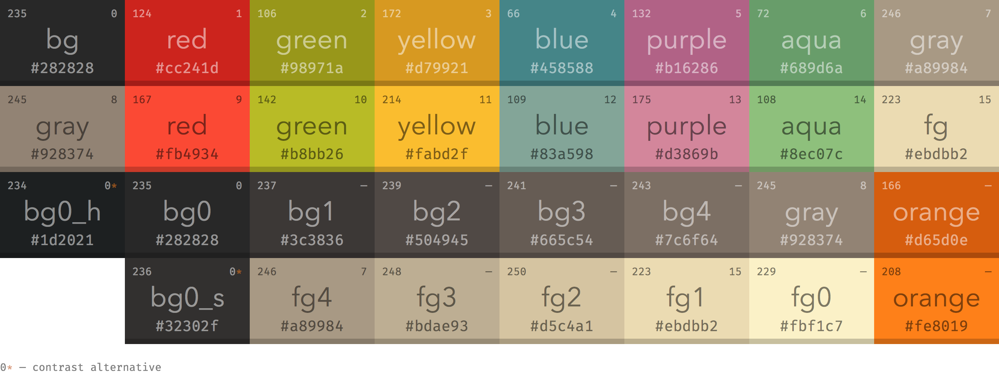

# Prompt: Build a Telegram Mini App Wallet on Ethereum Blockchain

You are tasked to design and implement a Telegram Mini App that functions as a cryptocurrency wallet for the Ethereum blockchain. The app should allow users to:

- Login Screen Loading
- First Time User Create Wallet or Import Wallet Key, Returning User Login with Password
- View their Native Coin and ERC-20 token balances
- Send and receive Native Coin and ERC-20 tokens
- Enable QR Code scanning for addresses and QR Code address receiving
- Display recent transaction history
- Display Total Staking and Rewards 
- Ensure secure authentication and transaction signing
- Provide a user-friendly interface optimized for mobile devices
- Integrate with Telegram's Mini App API for seamless user experience
- Handle errors gracefully and provide informative feedback to users
- Ensure compliance with relevant security standards and best practices
- Good Interface and User Experience, Use Modern Design Principles
- Implement responsive design for various screen sizes
- Optimize performance for quick load times and smooth interactions

**Requirements:**

- Use Telegram Mini Apps API for frontend integration
- Interact with My Private blockchain using a suitable library (e.g., ethers.js or web3.js)
- Prioritize user security and privacy
- Provide a simple, intuitive user interface
- ensure compatibility with major mobile browsers

**Bonus:**

- Support for NFT viewing
- Gas fee estimation and customization
- Multi-language support
- Dark mode support
- Provide documentation for setup, usage, and security features
- Firedrops: Airdropping by generate links, firedrop can use tokens or native to users but random amount token they receive

**Color Scheme:**

- Primary Color: #232323
- Button Color: #665c54
- Text Color: #ebdbb2

**Styling UI Interface Stack:**

- [Shadcn UI](https://ui.shadcn.com/docs/components)
- [Origin UI](https://originui.com/)
- [21st Dev](https://21st.dev/)
- [Kibo UI](https://www.kibo-ui.com/components/)
- [Re UI](https://reui.io/)

**Tech Stack:**
- Frontend: Vite, React, TypeScript
- Blockchain Interaction: ethers.js
- UI Components: Shadcn UI, Origin UI, 21st Dev, Kibo
- State Management: React Context or Redux
- QR Code Handling: qrcode.react or similar library
- Secure Storage: Use secure storage mechanisms for sensitive data

Describe your architecture, technology choices, and provide code samples for key features.
To build a Telegram Mini App that functions as a cryptocurrency wallet for the Ethereum blockchain, we will use a combination of modern web technologies and libraries. Below is an outline of the architecture, technology choices, and code samples for key features.